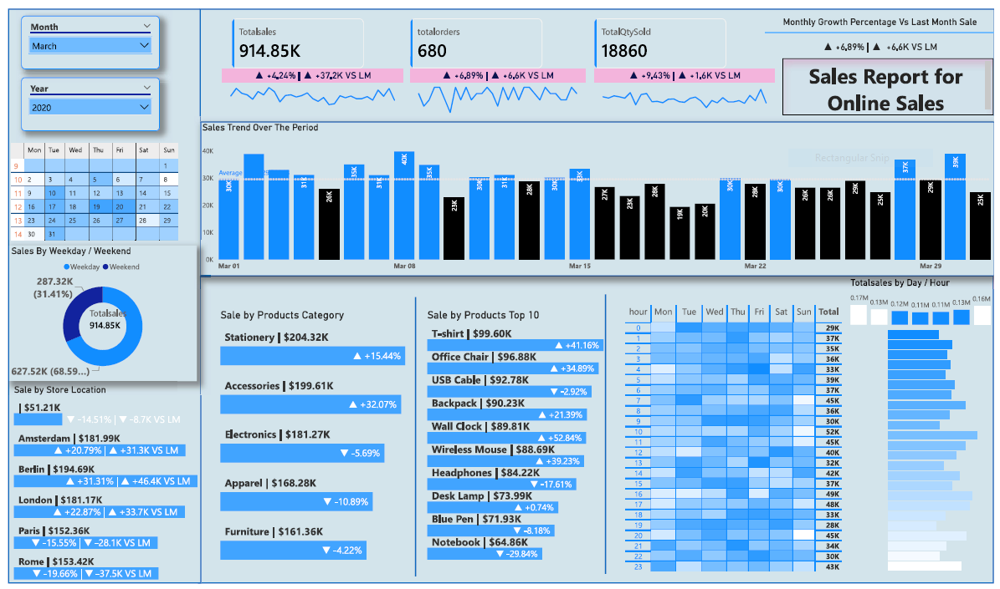
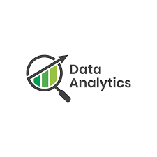

# sales_performance_analysis
End-to-end data-analysis of Online sales data  Using Excel , MYSQL , PowerBi to identify growth opportunities and reduce churn.📈 Sales Performance & Revenue Optimization Analysis

    End-to-end analysis of e-commerce sales data to identify growth opportunities and reduce churn.

🎯 Business Problem
The objective of this project is to address a 15% year-over-year decline in regional sales by identifying underperforming product categories and customer segments. This analysis provides data-driven recommendations to optimize inventory and marketing spend.
🛠️ Tech Stack & Skills

## My FILES IMAGE

<!-- Improved compatibility of back to top link -->

<!-- PROJECT SHIELDS -->

---

<!-- PROJECT LOGO -->

 

<h3 align="center">Data Analyst Portfolio</h3>

A comprehensive portfolio showcasing real-world data analysis projects, dashboards, and insights.

 

<a href="https://github.com/leggerse/sales_performance_analysis"><strong>Explore the Projects »</strong></a>

 

 

<a href="#projects">View Projects</a>

·

<a href="https://github.com/leggerse/sales_performance_analysis/issues">Report Issue</a>

·

<a href="https://github.com/leggerse/sales_performance_analysis/issues">Request Feature</a>

---

<!-- TABLE OF CONTENTS -->

Table of Contents

<ol>

<li>

<a href="#about-the-portfolio">About the Portfolio</a>

<ul>

<li><a href="#skills-and-tools">Skills and Tools</a></li>

</ul>

</li>

<li>

<a href="#projects">Projects</a>

<ul>

<li><a href="#sql-projects">SQL Projects</a></li>

<li><a href="#python-projects">Python Projects</a></li>

<li><a href="#dashboard-projects">Dashboard Projects</a></li>

</ul>

</li>

<li><a href="#data-sources">Data Sources</a></li>

<li><a href="#methodology">Methodology</a></li>

<li><a href="#how-to-use-this-repository">How to Use This Repository</a></li>

<li><a href="#roadmap">Roadmap</a></li>

<li><a href="#contact">Contact</a></li>

<li><a href="#acknowledgments">Acknowledgments</a></li>

</ol>

---

## Explanation of Project

SmartyPants converts ASCII punctuation characters into "smart" typographic punctuation HTML entities. For example:

|  NAME  |DESCRIPTION  |YES FILE  |

|----------------|-------------------------------|-----------------------------|

|EXCEL  |`'IsDATASETS AND CODSfun?'`  |'VERY NICCEEEEE?'  |

|MY SQL  |`"Isn't this fun?"`  |"YES FUNNNNNNN?"  |

|POWERBI  |`-- is en-dash, --- is em-dash` |-- --- -- dash|

## About the Portfolio

This repository is a **Data Analyst Portfolio** designed to demonstrate my ability to:

- Analyze structured and unstructured datasets

- Clean, transform, and validate data

- Perform exploratory and statistical analysis

- Create dashboards and visualizations

- Translate data insights into actionable business recommendations

Each project reflects **real-world business problems** and follows a structured analytical approach—from raw data to insights and conclusions.

(<a href="#readme-top">back to top</a>)

---

### Skills and Tools

**Technical Skills**

- Data Cleaning & Wrangling

- Exploratory Data Analysis (EDA)

- Statistical Analysis

- KPI Development

- Data Visualization

- Business Insights & Reporting

**Tools & Technologies**

- **SQL** (PostgreSQL, MySQL)

- **Python** (Pandas, NumPy, Matplotlib, Seaborn)

- **Excel** (Advanced formulas, Pivot Tables, Power Query)

- **Power BI / Tableau**

- **Jupyter Notebook**

- **Git & GitHub**

(<a href="#readme-top">back to top</a>)

---

## Projects

### SQL Projects

- **Sales Performance Analysis**

- Analyzed sales trends, revenue growth, and customer segmentation

- Used CTEs, window functions, and joins

- **Customer Retention Analysis**

- Identified churn patterns and retention KPIs

### Python Projects

- **Exploratory Data Analysis (EDA)**

- Cleaned and analyzed large datasets using Pandas

- Visualized trends and correlations

- **Time Series Analysis**

- Forecasted sales and demand trends

### Dashboard Projects

- **Power BI Sales Dashboard**

- Interactive KPIs and drill-downs

- **Tableau Marketing Dashboard**

- Campaign performance and ROI tracking

📁 Each project folder contains:

- Problem statement

- Dataset

- Analysis notebook / SQL scripts

- Visualizations

- Key insights and conclusions

(<a href="#readme-top">back to top</a>)

---

## Data Sources

Data used in this portfolio comes from:

- Public datasets (Kaggle, government portals)

- Simulated business datasets

- Open-source repositories

All datasets are used **for educational and portfolio purposes only**.

(<a href="#readme-top">back to top</a>)

---

## Methodology

Each project follows a structured approach:

1. Business Understanding

2. Data Collection

3. Data Cleaning & Preparation

4. Exploratory Data Analysis

5. Insight Generation

6. Visualization & Reporting

7. Business Recommendations

(<a href="#readme-top">back to top</a>)

---

    Data Extraction: SQL (Complex JOINs, Window Functions, CTEs)
    Data Cleaning: Python (Pandas for handling missing values and data types)
    Visualization: Tableau/Power BI (Interactive dashboards for stakeholder reporting)
    Statistical Analysis: Hypothesis testing (A/B testing) and Time Series Forecasting.

🔍 Key Insights & Recommendations

    Insight: Identified that the "Home Office" segment contributes 40% of revenue but has the highest return rate (12%).
    Recommendation: Implement a targeted quality check for the top 5 most-returned products in the Home Office category.
    Impact: Projected to save $15,000 annually in logistics costs and improve customer retention by 8%.

🚀 How to View

    [Interactive Dashboard Link] (Link to Tableau Public or Power BI service)
    [Notebook Analysis] (Link to the Jupyter Notebook or SQL script in this repo)

